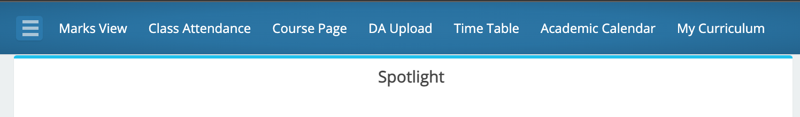
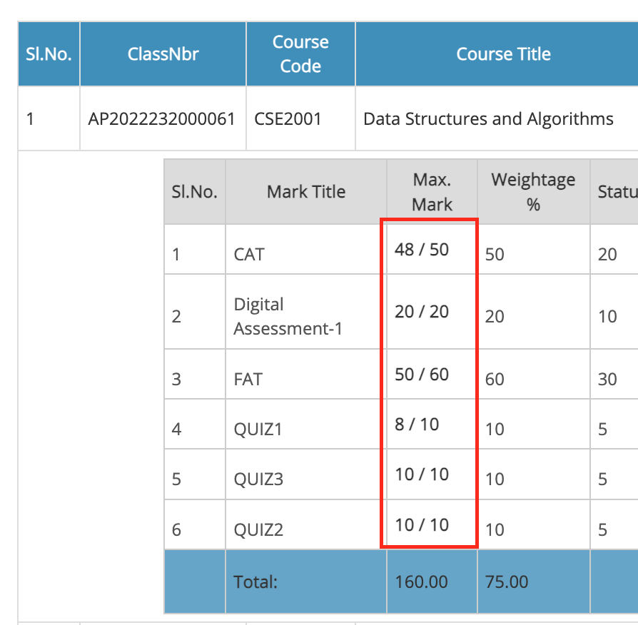

# vRevamp 🚀

<div align="center">

[](https://www.gnu.org/licenses/gpl-3.0)
[](https://chrome.google.com/webstore/detail/vrevamp/jfmlhhjlkbliphgkmeingeacbijcilcl)
[](https://github.com/sanjay7178/vRevamp/actions/workflows/main.yml)
[](https://github.com/sanjay7178/vRevamp/releases)

**Enhancing your VTOP experience - Making VIT portal usage seamless and efficient**

[📦 Install Extension](https://chrome.google.com/webstore/detail/vrevamp/jfmlhhjlkbliphgkmeingeacbijcilcl) • 
[📋 Report Issues](https://github.com/sanjay7178/vRevamp/issues) • 
[🔄 Releases](https://github.com/sanjay7178/vRevamp/releases) • 
[🔒 Privacy Policy](https://vrevamp.nullchapter.tech/privacy-policy)

</div>

## Table of Contents

- [About](#about)
- [Features](#features)
- [Installation](#installation)
- [Usage](#usage)
- [Screenshots](#screenshots)
- [Development](#development)
- [Contributing](#contributing)
- [License](#license)
- [Support](#support)

## About

vRevamp is a Chrome extension designed to enhance the VTOP (VIT Top) portal experience for students at VIT (Vellore Institute of Technology). It streamlines common tasks, automates repetitive processes, and provides additional functionality to make your academic portal usage more efficient and user-friendly.

## Features

### 🎯 Core Features
- **📝 Automatic Captcha Filling**: Eliminates the hassle of manually entering captchas
- **📊 Attendance Calculator**: Helps maintain minimum 80% attendance with smart calculations
- **🎯 Grade Calculator**: Quick calculation of required grades for passing
- **📅 Calendar Integration**: Sync exam schedules with Google Calendar and other calendar apps
- **🧭 Enhanced Navigation**: Quick access navbar with frequently used VTOP pages
- **📁 Smart Downloads**: Bulk download materials with proper naming conventions
- **📈 Marks Visualization**: Enhanced marks page with better grade display and semester analysis

### 🔧 Technical Features
- **🖱️ One-Click Operations**: Streamlined workflows for common tasks
- **💾 Data Persistence**: Saves your preferences and settings
- **📱 Cross-Platform**: Works on all platforms supporting Chrome extensions
- **🔄 Auto-Updates**: Seamless updates through Chrome Web Store

### 📊 Academic Tools
- **📋 Semester-wise GPA tracking**
- **📈 Attendance percentage monitoring**
- **⏰ Exam schedule management**
- **📚 Course material organization**
- **🎯 Grade requirement analysis**

## Installation

### From Chrome Web Store (Recommended)
1. Visit the [vRevamp Chrome Web Store page](https://chrome.google.com/webstore/detail/vrevamp/jfmlhhjlkbliphgkmeingeacbijcilcl)
2. Click "Add to Chrome"
3. Confirm the installation by clicking "Add extension"
4. The extension will be automatically installed and ready to use

### Manual Installation (For Developers)
1. Clone this repository:
   ```bash
   git clone https://github.com/sanjay7178/vRevamp.git
   ```
2. Open Chrome and navigate to `chrome://extensions/`
3. Enable "Developer mode" in the top right corner
4. Click "Load unpacked" and select the cloned repository folder
5. The extension will be loaded and ready for development/testing

## Usage

1. **First Time Setup**: After installation, navigate to any VTOP page
2. **Automatic Enhancement**: The extension automatically enhances VTOP pages
3. **Access Features**: Use the enhanced navigation bar and automated tools
4. **Calendar Integration**: Grant calendar permissions when prompted for exam sync
5. **Customize Settings**: Access extension settings through the popup menu

### Supported VTOP Domains
- `vtop.vitap.ac.in`
- `vtopcc.vit.ac.in`
- `web.vitap.ac.in`

## Screenshots

| Feature | Description |
|---------|-------------|
|  | Enhanced navigation with quick access buttons |
|  | Improved marks display with totals |

## Development

### Prerequisites
- Google Chrome browser
- Git for version control
- Text editor (VS Code recommended)

### Setup Development Environment
1. Clone the repository:
   ```bash
   git clone https://github.com/sanjay7178/vRevamp.git
   cd vRevamp
   ```

2. Load the extension in development mode:
   - Open Chrome and go to `chrome://extensions/`
   - Enable "Developer mode"
   - Click "Load unpacked" and select the project folder

3. Make your changes and reload the extension to test

### Project Structure
```
vRevamp/
├── manifest.json           # Extension manifest
├── js/                    # JavaScript modules
│   ├── attendance.js      # Attendance calculator
│   ├── marks_page.js      # Marks page enhancements
│   ├── exam_schedule.js   # Exam calendar integration
│   └── ...
├── css/                   # Stylesheets
├── html/                  # HTML files (popup, etc.)
├── assets/               # Icons and images
└── service_worker/       # Background scripts
```

## Contributing

We welcome contributions from the community! Please read our [Contributing Guidelines](CONTRIBUTING.md) for details on:

- How to set up your development environment
- Code style and standards
- Submitting pull requests
- Reporting issues

## License

This project is licensed under the GNU General Public License v3.0 - see the [LICENSE](LICENSE) file for details.

## Support

- **🐛 Report Issues**: [GitHub Issues](https://github.com/sanjay7178/vRevamp/issues)
- **💬 Discussions**: [GitHub Discussions](https://github.com/sanjay7178/vRevamp/discussions)
- **📧 Contact**: Visit our [website](https://vrevamp.nullchapter.tech) for more information

## Recent Updates

### Version 4.5.20
- Latest stable release with multiple enhancements
- Improved calendar integration
- Bug fixes and performance improvements

### Version 2.7
- Added .ics feature for exam schedule export
- Compatible with Outlook and various calendar applications
- Experimental Google Calendar integration

### Version 2.5.1
- Major bug fixes in course page navigation
- Added new navigation buttons
- Enhanced user interface

---

<div align="center">

**Made with ❤️ for VIT students**

⭐ Star this repository if you find it helpful!

</div>
